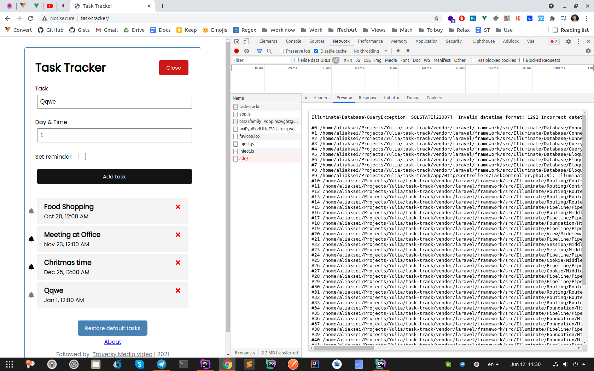

# Bugs
1. Add a task with invalid date format:

   There should be a constraint on frontend or/and backend.

2. Timestamp in `created_at` and `updated_at` are set 3 hours' time
earlier
# Code

## Database
1. execution_date -> due_date
2. Date: should be simple text, not datetime. If datetime, then 
   should have set constraints
3. datetimeTz -> just datetime   

## Laravel
1. `about.blade.php` 

Layouts are used to build layouts, not whole pages.

Mention versioning.

2. Returning text, not json.

3. Model name should be a singular noun, not `Tasks`

4. Just write `$task->save()`. Ты даже не получишь 
`Something went wrong!`, потому что кидаются 
   эксепшены :) (глянуть код `save()`)
   
5. Don't need `findOrFail` in `delete` method, потому что
у тебя и так видны таски, которые надо удалить

6. Рауты должны были быть в `api.php`

7. Tell about new routes and controllers syntax

## Vue

1. Тернарный оператор в :class в TodoForm
   https://stackoverflow.com/a/41969390/8215541
   
2. @ вместо v-on

3. Можно писать просто `required` в инпутах

4. Описывать тип пропсов

5. execution_date - странное название ) Лучше due_date

6. hiddenform -> formClosed, isFormClosed - булевы переменные

7. Можно было бы брать id для таски просто через
this.tasks.length + 1
   
   Рассказать про своё видение:
впадлу писать ифы, скобки... Может, есть способ лучше?
   
8. Надо бы занести http://task-tracker в константу где-нибудь
в js-е и ларавеле
   
9. Не используй jQuery:

`$('meta[name="csrf-token"]').attr('content')`

10. Операции с UI должны идти первее операций с бд
    (метод newTask())
    
11. `this.hiddenForm = !this.hiddenForm`

12. restoreTasks() - не помешал бы комментарий, что мы
удаляем таски, если у нас есть какие-то таски. 
    Долго вникать)
    
13. В computed() можно писать btnText() - это то же самое.
Также: `return this.hiddenForm ? 'Add' : 'Close'`

## Other
1. Strange spaces and formatting, e.g.:
```
$saved=$task->save();

if($saved===true){
   return response()->json('Task added!');
}else{
   return response()->json('Something went wrong!');
}

```